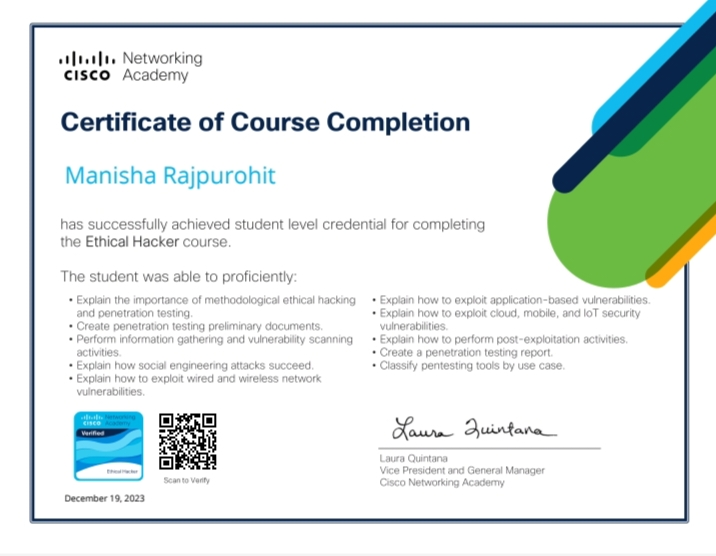

# 🛡️ Ethical Hacker Certificate

## 📋 Course Overview

This certificate was awarded by **Cisco Networking Academy** upon successful completion of the **Ethical Hacker** course.  
It recognizes the achievement of core skills required for ethical hacking and penetration testing.

- 📅 **Date Completed:** December 19, 2023
- 🎓 **Credential Level:** Student
- 🏫 **Offered by:** Cisco Networking Academy

---

## ✅ Skills Gained

Throughout the course, I developed practical and theoretical skills in:

- ✅ Methodological ethical hacking and penetration testing
- ✅ Creating penetration testing preliminary documents
- ✅ Information gathering and vulnerability scanning
- ✅ Social engineering attack techniques
- ✅ Exploiting wired and wireless network vulnerabilities
- ✅ Application-based vulnerability exploitation
- ✅ Cloud, mobile, and IoT security vulnerabilities
- ✅ Post-exploitation and reporting
- ✅ Classification of pentesting tools by use case

---

## 🔗 Verification

You can verify the certificate using the QR code embedded in the certificate or contact me directly for validation.

📬 **Email:** rajpurohitmanisha1606@gmail.com  
🔗 **LinkedIn:** [Manisha Rajpurohit](https://www.linkedin.com/in/manisha-rajpurohit-ba1616260)

---

> This course marks an important milestone in my journey toward becoming a skilled SOC Analyst and cybersecurity professional.
